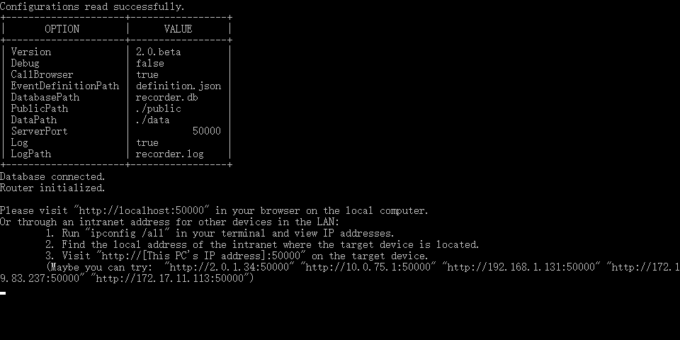

# DrivingEventRecorder

这是一个驾驶事件记录器. 用于在驾驶行为实验中采集数据.

项目前后端分离, master 分支中不会存储代码, 请分别参考: [frontend](https://github.com/zhzyX/DrivingEventRecorder/tree/frontend) 和 [backend](https://github.com/zhzyX/DrivingEventRecorder/tree/backend).

**项目仅在最新版 Chrome 和 Edge 中得到测试. 如果你遇到了影响正常使用的 Bug 或兼容性问题, 请前往 [Issue 页面](https://github.com/zhzyX/DrivingEventRecorder/issues) 提交. 如果可能的话, 请同时提交你的日志信息.**

## 应用截图

### 应用控制台输出

### 前端页面

## 如何使用?

1. 到 [Releases](https://github.com/zhzyX/DrivingEventRecorder/releases) 页面下载并解压应用, 如果你已经下载, 请跳过这一步.
2. 编辑应用目录下的 `config.ini` 文件, 你可能需要调整以下配置 (注意: 每次修改配置后都需要重新启动应用):
	* `dev` 部分的 `call_browser` 配置项: 设置为 `true` 以自动启动浏览器并跳转至应用页面.
	* `resource` 部分的 `video_path` 配置项 (**重要**): 设置为你的视频文件所在目录, 应用将读取对应目录下 (但不包括子目录) 的所有 mp4 格式的视频, 并在前端页面展示出来.
	* `server` 部分的 `port` 配置项: 设置应用默认端口
	* `server` 部分的 `log` 配置项: 设置为 `true` 以重定向日志到 `log_path` 所指定的文件, 当值为 `false` 时 `log_path` 项将被忽略.
	* `database` 部分的 `init_script` 配置项: 设置为 `.\db\init_db.sql` 时数据库将会初始化为中文; 设置为`.\db\init_db_en.sql` 时数据库将会以英文初始化. 每次修改这项配置后都需要删除 `db` 目录下的 `event.db` 文件以重新初始化.
3. 启动应用, 有如下几种方法可以启动应用:
	* [推荐👍] 在控制台中跳转到应用目录, 执行 `.\recorder.exe`
	* 打开应用目录, 在资源管理器地址栏输入 `cmd /c .\recorder.exe`
	* 直接双击打开目录下的 `recorder.exe`
4. 如果配置文件中 `call_browser` 项为 false, 你还需要:
	* 打开任意的现代浏览器, 在地址栏输入 `http://localhost:5000` (如果你修改了配置文件中的 `port` 项, 你可能需要修改冒号后的数字为 `port` 项设置的值)
	* 如果你需要在局域网内其它终端使用, 你需要首先获取计算机在当前网络中的地址 (应用自动推测的地址并不总是正确, 使用 `ipconfig`)

## 注意事项

* 如果你使用非推荐方式运行程序发生闪退, 这有可能是你的配置出现错误, 请以推荐方式运行以获取更多信息, 或者修改配置文件中的 `log` 项为 `true`, 并查看 `log_path` 项指定的文件.
* **不要同时使用实时事件采集和视频事件采集, 这两者共享事件暂存区:** 也就是当你在其中一处增加事件后, 能够在另外一处看到刚才增加的事件. 这不是 Bug, 但仍然可能影响到你的正常使用. 也许我会在不久之后考虑调整这个问题, 但现在没有这个计划.

## 特性

- [x] 视频事件模块支持视频倍速
- [x] 视频事件模块支持翻转视频
- [x] 支持中英文切换
- [x] 评分界面更多选项
- [ ] 评分下载
- [ ] 评分界面绘制曲线图
- [ ] 在首页对应用进行配置

> 我会尽可能逐渐添加必要的新特性, 但无法对进展做出保证. 如果你的确非常需要某些功能, 请前往 [Issue 页面](https://github.com/zhzyX/DrivingEventRecorder/issues) 提交新的请求, 或者直接 [与我联系](mailto:i@zhzyx.me).